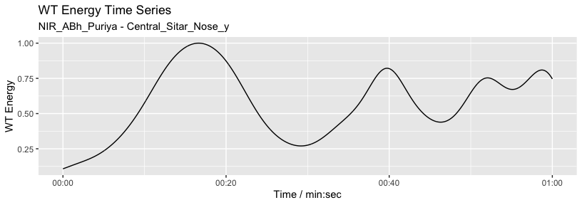
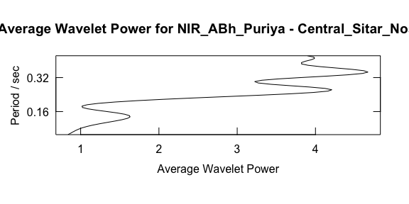

<!-- README.md is generated from README.Rmd. Please edit that file -->

# movementsync: Analysis and Visualisation of Musical Audio and Video Movement Synchrony Data

<!-- badges: start -->

[](https://lifecycle.r-lib.org/articles/stages.html#experimental)
<!-- badges: end -->

The goal of movementsync is to provide analysis and visualisation of
synchrony, interaction, and joint movements from audio and video
movement data of a group of music performers. Functions in the library
offer analysis routines for visualising, selecting, and filtering data.
Analysis functions for carrying out Granger causality analysis and
wavelet analysis are included. Routines for combining movement data,
music instrument onsets, and annotations are also offered in the
library.

**Note:** *Movement data* is obtained through analysis of videos using
suitable computer vision techniques
(e.g. [openpose](https://github.com/CMU-Perceptual-Computing-Lab/openpose)
or obtaining motion capture data. Similarly, *onset data* is extracted
from audio recordings using onset detection algorithms. Also, the
*annotations* of rhythmic structures, musical events, or musical form of
an ensemble performances can be carried out in
[ELAN](https://archive.mpi.nl/tla/elan) or another annotation tool for
audio and video. `movementsync` library does not deal with this initial
extraction of pose from video or onsets from audio, but it offers a
versatile suite of functions to analyse the extracted data.

The library supports the open data described in Clayton, Leante, and
Tarsitani (2021) <doi:10.17605/OSF.IO/KS325>. Example analyses can be
found in Clayton, Jakubowski, and Eerola (2019)
<doi:10.1177/1029864919844809>. Wavelet analysis techniques applied to
musical interactions have been reported in Eerola et al. (2018)
<doi:10.1098/rsos.171520>.

## Installation

You can install `movementsync` from CRAN:

``` r
install.packages("movementsync")
```

## Load sample data

Here we load a short demo data that comes with the package. This data is
1 min of video/feature data (1500 observations with 25 frames per second
(fps) taken from North Indian Raga performance by *Anupama Bhagwat*
(sitar) and *Gurdain Rayatt* (Tabla) performing *Rag Puriya* (Recording
ID as `NIR_ABh_Puriya` available in [OSF](https://osf.io/ks325/). The
first video frame of the performance is shown in the image below. You
can use external datasets and our longer demonstrations for more
extensive examples.


Get all markers of the sitar player and plot them.

``` r
library(movementsync)
r1 <- get_sample_recording()                                                # Defaults to NIR_ABh_Puriya
rv1 <- get_raw_view(r1, "Central", "", "Sitar")                             # Take the sitar player
pv1 <- get_processed_view(rv1)
dp <- c("LWrist","RWrist","LElbow","RElbow","LEye","REye","Neck","MidHip")  # Define markers
fv1 <- apply_filter_sgolay(pv1, data_point = dp, n = 41, p = 4)             # Apply smoothing
distribution_dp(fv1)                                                        # Plot
```


Plot the Y coordinate of the nose marker from the sitar player.

``` r
autoplot(pv1, columns = c("Nose_y"))                        # Define markers/coords and plot
```


### Filtering

We usually want to filter raw movement data and here we use a
Savitzy-Golay filter to smooth the data.

``` r
fv1 <- apply_filter_sgolay(pv1, "Nose", n = 81, p = 4)      # Filter with rather heavy parameters    
autoplot(fv1, columns = c("Nose_y"))                        # Define markers and coordinates and plot 
```


### Annotation

Add an arbitrary annotation that contains three 20-second segments (A,
B, and C).

``` r
l <- list(A = c(0, 20), B = c(20, 40), C = c(40, 60))         # Define three segments
splicing_dfr <- splice_time(l)                                # Create a splicing table
autoplot(fv1, columns = c("Nose_y")) +                        # Plot 
  autolayer(splicing_dfr)                                     # add annotations to the plot  
```


## Granger causality analysis

Are the head movements of the two musicians related to each other? Is
one of the musicians leading the movements and the other is following?
To explore this, we can apply Granger causality analysis. Here we take
the nose markers from both sitar and tabla players, apply a smoothing
filter, and obtain a combined view of this data.

``` r
fv_list <- get_filtered_views(r1, data_points = "Nose", n = 41, p =3) # Filter
jv <- get_joined_view(fv_list)                                        # Combine the data
```

### Time splices

Next we split our data into 30-second segments with a 6-second step size
to create segments to be tested with the Granger causality analysis.
This is an extremely blunt way of performing the analysis but
illustrates the procedure.

``` r
splicing_df <- splice_time(jv, win_size = 30, step_size = 6)            # Splice into segments
sv <- get_spliced_view(jv, splicing_df)                                 # Prepare the data       
autoplot(sv,columns = c('Nose_y_Central_Sitar','Nose_y_Central_Tabla')) # Plot selected coordinates
```


Now we apply the Granger analysis to the segments and test how the
musicians influence each other in each segment. The null hypothesis is
that Tabla doesn’t influence Sitar and the p-values from the analysis
are plotted as an indicator of the strength of the causality.

``` r
g <- granger_test(sv, 
                  "Nose_y_Central_Sitar", "Nose_y_Central_Tabla", 
                  lag = 12/25)                                 # apply granger analysis
autoplot(g, splicing_df = splicing_df)                         # show p-values (forward and backwards) 
```


As we can see from the visualisation, there is not much causality taking
place between the two performers as evidenced by the high p values. The
last segments suggest a weak causality where sitar can be seen driving
the tabla. The interpretation of these 30-second segments of the
vertical head movement is challenging, especially when we know that the
sitar player is the only musician producing sounds during these first
60-seconds of the opening alap. The tabla player may still be reacting
to the performance of the sitar player and coordinating actions through
performance cues (gaze) during the opening section.

## Wavelet analysis

Here we characterise the sitar player’s vertical movement periodicity
with wavelet analysis constrained to 0.1 to 0.5 seconds. Note that the
graphics output is driven by
[`waveletComp`](https://CRAN.R-project.org/package=WaveletComp) package
(see Roesch and Schmidbauer, 2018).

``` r
w <- analyze_wavelet(pv1, "Nose_y", lowerPeriod = 0.1, upperPeriod = 0.5, verbose = FALSE, dj = 1/25)
#>   |                                                                              |                                                                      |   0%  |                                                                              |======================================================================| 100%
plot_power_spectrum(w, pv1)
```


From this analysis we can summarise the periodicity over time.

``` r
plot_wt_energy(w, pv1)
```



Or we can summarise the average power across frequency.

``` r
maximum.level <- 1.001*max(w$Power.avg)
plot_average_power(w, pv1, maximum.level = maximum.level, show.siglvl=FALSE)
```



## References

- Clayton, M., Leante, L., & Tarsitani, S. (2021, April 15). *IEMP North
  Indian Raga*. <doi:10.17605/OSF.IO/KS325>
- Clayton, M., Jakubowski, K., & Eerola, T. (2019). Interpersonal
  entrainment in Indian instrumental music performance: Synchronization
  and movement coordination relate to tempo, dynamics, metrical and
  cadential structure. *Musicae Scientiae, 23(3)*, 304–331.
  <doi:10.1177/1029864919844809>
- Eerola, T., Jakubowski, K., Moran, N., Keller, P., & Clayton, M.
  (2018). Shared Periodic Performer Movements Coordinate Interactions in
  Duo Improvisations. *Royal Society Open Science, 5(2)*, 171520.
  <doi:10.1098/rsos.171520>
- Roesch A., \* Schmidbauer, H. (2018). *WaveletComp: Computational
  Wavelet Analysis*. R package version 1.1,
  <https://CRAN.R-project.org/package=WaveletComp>.
